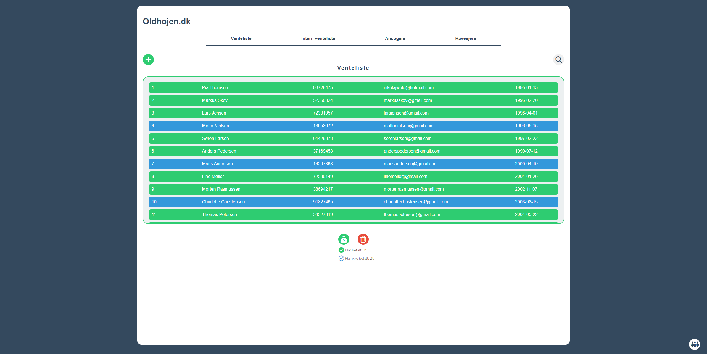

# Eksys2023

This project is from the course "Exponentiel System-development", which is in the third semester of IT Product-development.

Together with two fellow students, I established partnership with a local community garden association, 
where we together developed a system for them to improve their administrative handling of the 'waiting list'. 

### Abstract of the assignment done by me and my group

This report presents the development and implementation of a waiting list management
system for a local community garden association. The existing system utilized Excel
spreadsheets for managing the waiting list, which proved inefficient. It also severely limited
their ability to communicate with the people on the waiting list due to time consumption.

We found that the board members spent unnecessary time communicating with individual
members of the waiting list as a result of the lack of information given in plenary. Our aim
was to create a more streamlined application that allowed for a closer relationship with the
people on the waiting list while also decreasing unnecessary communication with individuals.
The project's development was heavily inspired by the practices of agile development and
participatory design. Through the use of methods like ‘contextual interview’ and with
inspiration from the method of ‘future workshop’ we attempted to understand our users' work
practices and needs.

The final prototype is a web-based service that combines much of the user's practice,
previously done in various programs, into one service. Our application manages all the
different lists of applicants with a simple mailing system that instantly contacts the different
groups using a specified template. It also serves as a public waiting list for potential applicants,
making it easier to get an overview of the waiting process.

*The public view of the waitinglist, where applicants are able to sign up*

*The admin-view of the waiting list. Admin can manage applicants, edit data and send emails collectively*

*Able to group applicants based on yearly paid contingent*

*Mailing system*

For running this projects, you might have to *npm install express*
